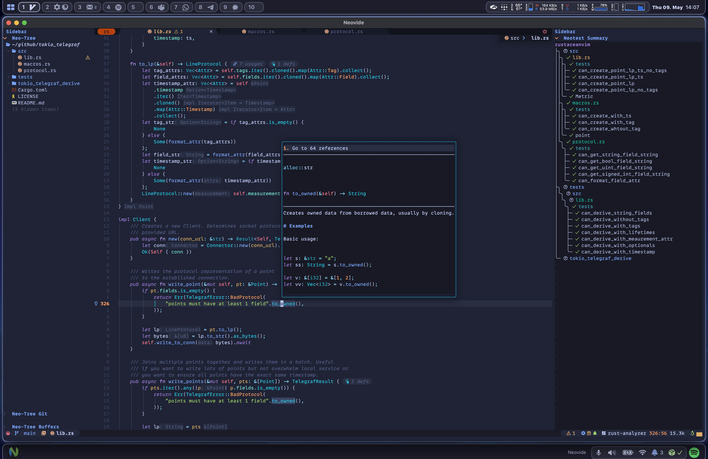

# 🤟 dotfiles 🤟

Personal config/dotfiles (nvim, zsh, tmux, git, and assorted macOS app
configs). Neovim setup is based on [LazyVim](https://www.lazyvim.org/).

## Look and feel



## Layout

Managed with [GNU Stow](https://www.gnu.org/software/stow/) — one
top-level directory per "package", each mirroring the path it should
land at relative to `$HOME`:

```
.
├── aerospace/.config/aerospace
├── borders/.config/borders
├── brewfile/.config/brewfile
├── ghostty/.config/ghostty
├── git/.gitconfig
├── git/.config/git-helpers.sh
├── ideavim/.ideavimrc
├── local-bin/.local/bin/          (git-done, git-goal, git-save, ...)
├── nvim/.config/nvim
├── nvim-bak/.config/nvim-bak      (backup config — not stowed by default)
├── television/.config/television
├── tmux/.tmux.conf
├── yazi/.config/yazi
└── zsh/.zshrc
```

Previously this repo used [homeshick](https://github.com/andsens/homeshick)
(everything lived under a single `home/` directory that homeshick linked as
a "castle"). It's been converted to Stow, which needs no extra tool sourced
in your shell rc and lets you link/unlink individual apps' configs
one at a time.

## Installing on a fresh machine

1. Install GNU Stow:
   ```sh
   brew install stow        # macOS
   sudo apt install stow    # Debian/Ubuntu
   ```
2. Clone this repo, e.g. to `~/dotfiles`:
   ```sh
   git clone https://github.com/sebastian-mossberg_epiroc/wsl-dotfiles.git ~/dotfiles
   cd ~/dotfiles
   ```
3. Symlink everything:
   ```sh
   ./install.sh
   ```
   or symlink just what you want, e.g. `./install.sh zsh git tmux`.

   Stow will refuse to overwrite a file that already exists at the
   target (e.g. a real `~/.zshrc` left over from before). Either
   remove/back up the existing file first, or use `--adopt` to pull
   the *existing* file into this repo instead (see below) — then
   review the diff before committing.

### Migrating away from an old homeshick install

If you still have the old homeshick "castle" linked:

```sh
source "$HOME/.homesick/repos/homeshick/homeshick.sh"
homeshick unlink <castle-name>     # removes homeshick's symlinks
```

Then run `./install.sh` from this repo as above. If `stow` complains a
target already exists, that's usually a stray real file (not a
symlink) rather than a leftover homeshick link — move it aside or use
`--adopt`.

### Adopting an existing config into the repo

If you already have, say, a real `~/.zshrc` you want to *become* the
version tracked here:

```sh
./install.sh --adopt zsh
git status   # review what --adopt pulled in before committing
git diff
```

> **Warning:** `--adopt` overwrites the file **in this repo** with
> whatever currently exists at the target path in `$HOME`. Double
> check `git diff` before committing so you don't silently lose the
> version you meant to keep.

### Unlinking a package

```sh
stow -t "$HOME" -D nvim
```

## Update mason-ensure-installed

```sh
echo "$(cat ~/.local/state/nvim/mason.log |grep "Installation succee" |awk -F'for Package' '{print $2}' |sed 's/(name=//g'| sed 's/)//g' | sort -u |xargs)" > ~/.config/nvim/mason-ensure-installed
```

## Update Mason installed plugins

```sh
vim "+MasonInstall $(cat ~/.config/nvim/mason-ensure-installed)"
```
